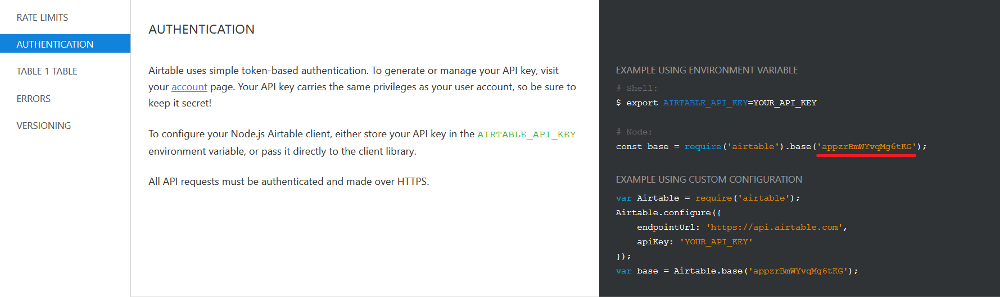

This plugin logs data about incoming Default Fallback Intents to an Airtable spreadsheet. Tracks: **UserID, Timestamp, Locale, State, Speech, Reprompt, Utterance (raw text)**.


# Installation

First of all you have to sign up to [Airtable](https://airtable.com/). After that go over to the [template](https://airtable.com/universe/expcg7NcTJWR9BJM7/jovo-plugin-fallback-airtable) and click on `Copy base` on the top right corner.

You also need an API key, which you can generate on your [account page](https://airtable.com/account)

The last thing you need is your base's ID. First go the [API page](https://airtable.com/api) and choose your base. It's most likely named `Jovo-Plugin-Fallback-Airtable`. Scroll down to `Authentication`, switch the example tab to `node.js` and copy the string marked in the example picture:



Now you can add the plugin to your project:
```sh
$ npm install jovo-plugin-fallback-airtable --save
```
In your Jovo project:
```javascript
const FallbackAirtable = require('jovo-plugin-fallback-airtable');

// Required:
let options = {
    apiKey: 'apiKey',
    baseId: 'baseId',
    tableName: 'tableName'
}

app.register('FallbackAirtable', new FallbackAirtable(options));
```

# License

MITs
