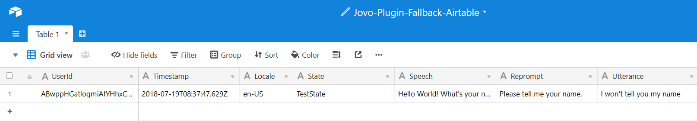

This plugin logs data about incoming Default Fallback Intents to an Airtable spreadsheet. Tracks: **UserID, Timestamp, Locale, State, Speech, Reprompt, Utterance (raw text)**.



# Installation

> If you are using the Jovo Framework version < 2.0.0, please checkout the v1 branch [here](https://github.com/KaanKC/jovo-plugin-fallback-airtable/tree/v1)

First of all you have to sign up to [Airtable](https://airtable.com/).

After that go over to the [template](https://airtable.com/universe/expcg7NcTJWR9BJM7/jovo-plugin-fallback-airtable) and click on `Copy base` on the top right corner.

You also need an API key, which you can generate on your [account page](https://airtable.com/account)

The last thing you need is your base's ID. First go the [API page](https://airtable.com/api) and choose your base. It's most likely named `Jovo-Plugin-Fallback-Airtable`. Scroll down to `Authentication`, switch the example tab to `node.js` and copy the string marked in the example picture:


Now you can add the plugin to your project:

```sh
$ npm install jovo-plugin-fallback-airtable --save
```

In your `app.js` project:

```javascript
const {FallbackAirtablePlugin} = require('jovo-plugin-fallback-airtable');

const app = new App();

app.use(
    // Other plugins
    new FallbackAirtablePlugin()
);
```

Last but not least, you have to add the api key and the base id to your `config.js` file:

```javascript
module.exports = {
    // other configurations
    plugin: {
        FallbackAirtablePlugin: {
            baseId: '<base-id>',
            apiKey: '<api-key>'
        }
    }
};
```

# License

MITs
